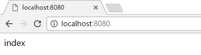

#vagrant laravel5运行环境配置

vi Vagrantfile
```
config.vm.box = "ubuntu"
config.vm.network "forwarded_port", guest:80, host:80
config.vm.network "forwarded_port", guest:8080, host:8080
config.vm.synced_folder "E:/demo", '/demo', :smb => true
config.vm.network "private_network", ip: "192.168.100.126"
```

vi /etc/php/7.0/fpm/pool.d/www.conf
```
listen = 127.0.0.1:9000
```
/etc/init.d/php7.0-fpm restart

cd /etc/nginx/sites-available
cp default default.bak
vi default
```
index index.php index.html index.htm index.nginx-debian.html;

location ~ \.php$ {
    include snippets/fastcgi-php.conf;

    # With php7.0-cgi alone:
    fastcgi_pass 127.0.0.1:9000;
    # With php7.0-fpm:
    # fastcgi_pass unix:/run/php/php7.0-fpm.sock;
}
```
/etc/init.d/nginx restart

cd /var/www/html
vi index.php
```
<?php phpinfo(); ?>
```
通过浏览器访问：http://localhost/


vi /etc/apache2/ports.conf
```
Listen 8080
```

cd /etc/apache2/sites-available
cp 000-default.conf 000-default.conf.bak
vi 000-default.conf 将第一行改为
```
<VirtualHost *:8080>
```
/etc/init.d/apache2 restart
通过浏览器访问：http://localhost:8080/


cd /etc/nginx/sites-available
vi laravel-demo.conf
```
server {
       listen 80;
       listen [::]:80;

       server_name laravel-demo.com;

       root /vagrant/laravel/public;
       index index.php index.html;

       location / {
               try_files $uri $uri/ =404;
       }

       location ~ \.php$ {
               include snippets/fastcgi-php.conf;
               fastcgi_pass 127.0.0.1:9000;
       }
}
```
/etc/init.d/nginx restart
通过浏览器访问：http://laravel-demo.com/


vi /etc/hosts
```
127.0.1.1       laravel-demo.com
```
curl -I "http://laravel-demo.com"

cd /etc/apache2/sites-available
cp 000-default.conf laravel-demo.conf
vi laravel-demo.conf  将对应选项更改成如下：
```
ServerName laravel-demo.com
ServerAdmin zhulinjie_cool@126.com
DocumentRoot /vagrant/laravel/public
```
/etc/init.d/apache2 restart
通过浏览器访问：http://laravel-demo.com:8080/

curl -I "http://laravel-demo.com:8080"